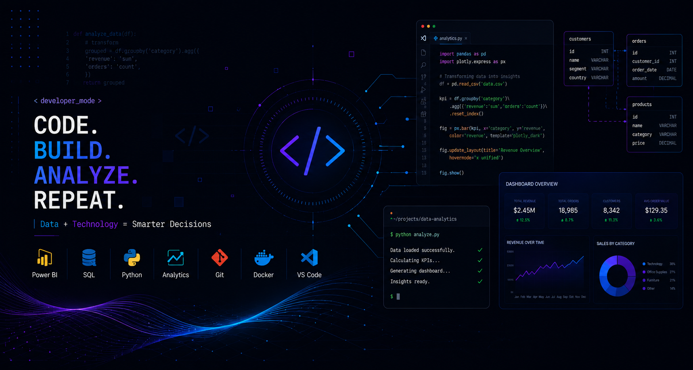

<h1 align="center">Arielly Lara</h1>

Biomedical Scientist transitioning into Data Analytics with focus on healthcare data, operational indicators and business intelligence.

Passionate about transforming data into strategic decisions

  

## Featured Skills

- Data Analytics
- Business Intelligence
- Dashboard Development
- Data Visualization
- Healthcare Analytics
